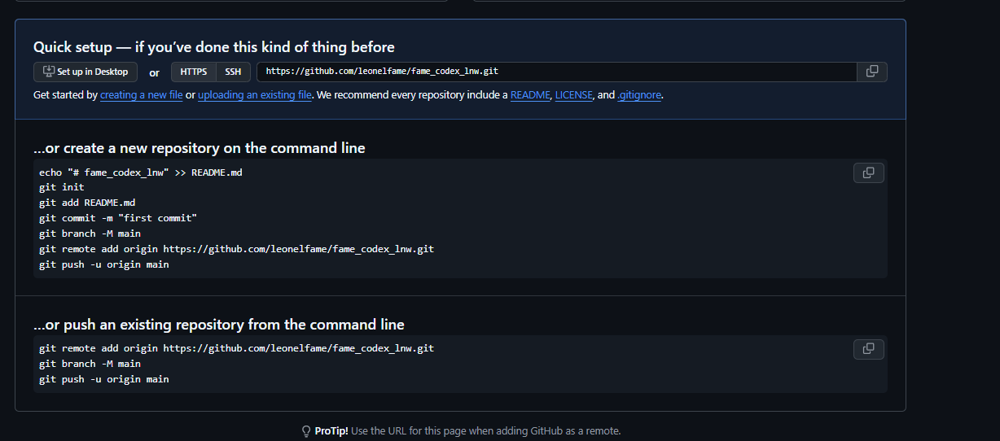

<h1 align="center">Fame Codex</h1>

<p align="center">
  <strong>Personal Codex launcher with a focused violet/cyan interface.</strong><br>
  ใช้ ChatGPT Web ผ่าน native Codex workflow พร้อม UI ที่ปรับแต่งสำหรับ Fame
</p>

<p align="center">
  <a href="TROUBLESHOOTING.md">Troubleshooting</a> ·
  <a href="SECURITY.md">Security</a> ·
  <a href="docs/architecture.md">Architecture</a> ·
  <a href="LICENSE">MIT License</a>
</p>

> [!IMPORTANT]
> Fame Codex เป็นโครงการ POC ที่พัฒนาต่อยอดจาก
> [miuuyy/codex-chatgpt-web](https://github.com/miuuyy/codex-chatgpt-web)
> และไม่ใช่ผลิตภัณฑ์อย่างเป็นทางการของ OpenAI
<p align="center">
  
</p>

## ภาพรวม

Fame Codex คงการทำงานหลักของ `codex-chatgpt-web` ไว้เหมือนเดิม แต่ปรับประสบการณ์
desktop launcher ให้มีเอกลักษณ์ของ Fame ได้แก่:

- UI สี violet/cyan พร้อม glass surface
- โลโก้และชื่อผลิตภัณฑ์ Fame Codex
- หน้าตา onboarding, sidebar และสถานะการทำงานที่เป็นธีมเดียวกัน
- ตัดปุ่ม GitHub และ X ออกจาก sidebar หลัก
- คง native Codex task, context lifecycle, streaming และ tool lifecycle
- รองรับ Browser-only, Full Harness และ Zero Risk ตามระบบต้นฉบับ

```text
Codex task ── Responses + SSE ──▶ local bridge ── embedded browser ──▶ ChatGPT
     ▲                                  │                                  │
     └──── native context, tools, images, tracing and lifecycle ──────────┘
```

## ความต้องการระบบ

- Windows 10 1809 ขึ้นไป, macOS 13 ขึ้นไป หรือ Linux x64
- [Bun 1.4.0](https://bun.sh/docs/installation)
- Codex ที่ติดตั้งและลงชื่อเข้าใช้แล้ว
- บัญชี ChatGPT ของผู้ใช้งานเอง

## เริ่มต้นใช้งาน

Clone repository:

```powershell
git clone https://github.com/leonelfame/fame_codex_lnw.git
cd fame_codex_lnw
```

ติดตั้ง dependencies ตาม lockfile:

```powershell
bun install --frozen-lockfile
cd launcher
bun install --frozen-lockfile
cd ..
```

เปิด Fame Codex:

```powershell
bun run app
```

จากนั้นทำขั้นตอนใน launcher:

1. ลงชื่อเข้าใช้ ChatGPT ผ่าน embedded browser
2. รัน browser smoke test
3. กด **Install models**
4. ปิด Codex ให้หมดและเปิดใหม่
5. เลือกโมเดล **ChatGPT Web — …** จาก model picker

## โหมดการทำงาน

| Mode | ChatGPT Web | Local Codex tools | เหมาะสำหรับ |
| --- | --- | --- | --- |
| Browser-only | อัตโนมัติ | ไม่มี | ทดลองใช้งานทั่วไป |
| Full Harness | อัตโนมัติ | มี ผ่าน MCP | งานที่ต้องใช้ filesystem, shell และ tools |
| Zero Risk | ส่ง prompt ด้วยตนเอง | มี ผ่าน MCP | ลดความเสี่ยงจาก browser automation |

Full Harness เชื่อม tool calls กลับมายัง Codex task ผ่าน OpenAI tunnel และ MCP
โปรดอ่าน [Security model](docs/security-model.md) ก่อนเปิดใช้งาน

## คำสั่งสำหรับพัฒนา

```powershell
bun run app
bun run launcher:dev
bun run launcher:typecheck
bun run launcher:test
bun run launcher:build
```

ตรวจสอบทั้งโปรเจกต์:

```powershell
bun run verify
```

## โครงสร้างหลัก

```text
launcher/              Electron + React desktop launcher
src/                   Responses bridge และ Codex integration
scripts/               build, verification และ packaging scripts
docs/                  architecture, security และ development notes
FAME_CODEX_NOTICE.md   ข้อมูลการดัดแปลงและ attribution
```

## Security

- Browser profile มีข้อมูล session ที่ละเอียดอ่อน ห้ามนำไปแชร์หรือ commit
- ใช้งานเฉพาะบนเครื่องที่เชื่อถือได้
- Full Harness สามารถเข้าถึง tools ตามสิทธิ์ของ Codex task
- ChatGPT UI อาจเปลี่ยนและทำให้ browser automation ใช้งานไม่ได้
- Temporary Chat ไม่ได้หมายความว่าประมวลผลแบบ local
- ห้าม hardcode API key หรือ credentials ลง source code

ดูรายละเอียดเพิ่มเติมที่ [SECURITY.md](SECURITY.md) และ
[docs/security-model.md](docs/security-model.md)

## License และเครดิต

Fame Codex พัฒนาต่อยอดจาก
[codex-chatgpt-web](https://github.com/miuuyy/codex-chatgpt-web)
ภายใต้ MIT License โดยยังคง copyright notice และ permission terms ของต้นฉบับไว้

- License: [LICENSE](LICENSE)
- Fame Codex notice: [FAME_CODEX_NOTICE.md](FAME_CODEX_NOTICE.md)
- Third-party notices: [LICENSES](LICENSES/)

Fame Codex เป็นโครงการอิสระ ไม่ได้เป็นพันธมิตรหรือได้รับการรับรองโดย OpenAI
ผู้ใช้งานต้องปฏิบัติตามข้อกำหนดของ OpenAI, ChatGPT และนโยบายของ workspace ของตนเอง